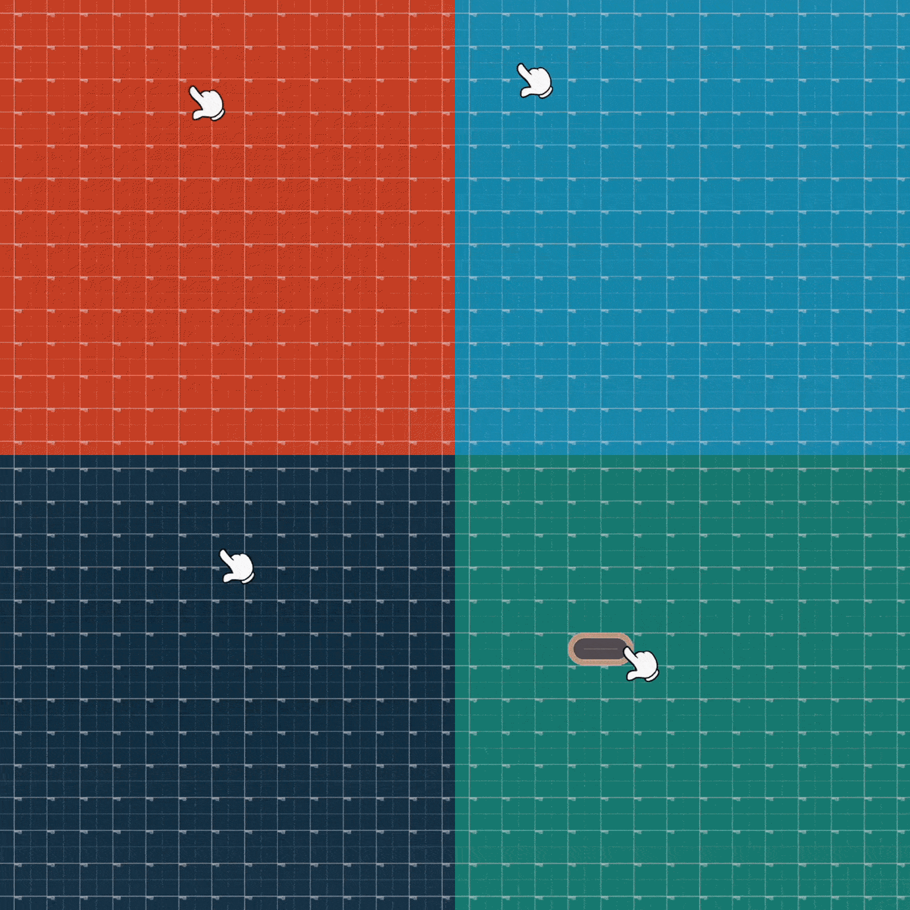

# Draw Road — Unity Road Drawing System

A grid-based, interactive road drawing tool for Unity 6. Draw roads in real-time by dragging across the grid; the system automatically detects tile topology and selects the correct road shape, rotation, and composite pieces.



---

## Features

- Click-and-drag road drawing with grid snapping
- Automatic shape detection: straight, corner, T-junction, 4-way, dead end
- Composite shape support: big corners, U-turns, S-curves
- Event-driven, decoupled architecture via `EventBus`
- Configurable via a single `RoadSetting` ScriptableObject
- Packaged as a Unity package (`com.bilalemre.roadsystem`)

## Requirements

- Unity 6000.0 or later

## Installation

**Option A — Package Manager**

1. Open **Window → Package Manager**
2. Click **+** → **Add package from disk**
3. Select the `package.json` file inside `Assets/RoadSystem/`

**Option B — Direct copy**

Copy the `Assets/RoadSystem/` folder into your project's `Assets/` directory.

## Setup

1. Add the following MonoBehaviours to a GameObject in your scene:
   - `RoadDrawInput` — assign your main camera
   - `GridController`
   - `RoadService` — assign a `RoadSetting` asset
2. Create a `RoadSetting` ScriptableObject and assign a prefab for each road shape.
3. Press Play and drag across the scene to draw roads.

## Architecture

```
RoadDrawInput          (mouse/pointer → drag & release events)
    │
    ▼  EventBus
GridController         (creates and connects Tile nodes)
    │
    ▼
RoadLayerResolver      (3-layer shape detection pipeline)
    │
    ▼
RoadService            (instantiates and configures RoadPiece prefabs)
```

### Systems

| System | Key Class | Responsibility |
|---|---|---|
| Input | `RoadDrawInput` | Raycasts mouse/pointer, publishes drag events |
| Event bus | `EventBus` | Decoupled pub/sub between systems |
| Grid | `GridController`, `Tile` | Maintains tile graph, tracks neighbor connectivity |
| Shape detection | `RoadLayerResolver` | 3-layer pipeline that resolves `RoadShape` per tile |
| Road rendering | `RoadService`, `RoadPiece` | Spawns prefabs, applies rotation/flip/alpha |
| Configuration | `RoadSetting` | ScriptableObject mapping shapes to prefabs |

### Shape Detection Layers

`RoadLayerResolver` runs three passes over the tile graph:

- **Layer 1** — Basic shapes from `TileTopology`: dead end, straight, corner, T-junction, 4-way
- **Layer 2** — Big corner detection across 2×2 tile clusters; inner tiles are marked `Invisible`
- **Layer 3** — Advanced composite shapes: S-curves and U-turns

### Road Shapes

```
Straight · DeadEnd · Corner · ShapeBigCorner
ThreeWay · FourWay · ShapeU · ShapeS · Invisible
```

## Project Structure

```
Assets/RoadSystem/
├── Scenes/          Sample scene
├── Scripts/
│   ├── Input/       RoadDrawInput, EventBus
│   ├── Grid/        GridController, Tile, TileFactory, GridMath
│   ├── Road/        RoadService, RoadPiece, RoadFactory, RoadSetting
│   ├── Shape/       RoadLayerResolver, RoadShape, TileTopology
│   └── Plugins/     CustomMouseCursor, EditorSnapController
└── Prefabs/         Road piece prefabs (End, Straight, Corner, T, Plus, BigCorner, U, S)
```

## License

MIT
